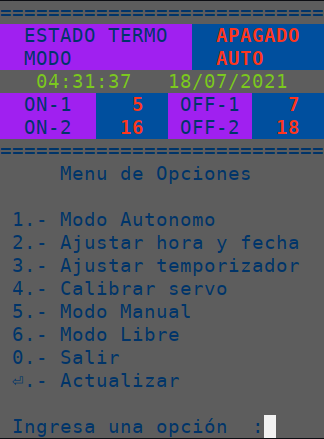

# Automatizacion de Caldera
***Control de encendido para caldera electrica.***


Enciende o apaga el termo según configuración. Admite hasta dos horarios de  
funcionamiento al día, ajustables en **modo 3**.  

El funcionamiento autonomo es la opción por defecto (**modo 1**).  

Funcionamiento manual espera instrucción para realizar acción de encendido  
o apagado (**modo 5**).  

Hora y fecha ajustables en el **modo 2**.  

Posiciones del servo al encender o apagar el termo (**modo 4**). Son dos posiciones,  
ya que el servo realiza movimiento repetitivo para asegurar el accionamiento  
mecánico del interruptor del termo.  

El **modo 6** permite mover libremente el servo (desde 16 hasta 144). Útil para probar ajustes.  

### Hardware utilizado:
- [ATmega328p](https://en.wikipedia.org/wiki/Arduino_Nano) (ArduinoNano old bootloader)  
- [Real time clock](https://en.wikipedia.org/wiki/Real-time_clock) (RTC-DS3231)  
- [Servo](https://es.wikipedia.org/wiki/Servomotor)  
- [esp8266](https://en.wikipedia.org/wiki/ESP8266) (ESP01)  
- [buck converter](https://en.wikipedia.org/wiki/Buck_converter)

**Arduino** funciona de forma autonoma, no requiere del módulo wifi.  
**ESP-01** funciona como interface web basica entre el usuario y el puerto serie de arduino.  

### Herramientas de control (scripts)
- [caldera.sh](https://gitea.kickto.net/SyDeVoS/Caldera-ino/src/branch/master/scripts#bash) (bash)
- [caldera.py](https://gitea.kickto.net/SyDeVoS/Caldera-ino/src/branch/master/scripts#python) (python)

-----

## Arduino
Control de horario de encendido caldera electrica.  
Trabaja de forma autonoma y/o comandado por puerto serie (**115200 baudio**).   

* 3 Modos de Operación
  - Automatizado (1, por defecto)
  - Manual (5) 
  - Libre (6)
* 3 Modos de Configuración
  - Configuración fecha y hora (2)
  - Configuración horas de encendido y apagado (3)
  - Configuración de posiciones de encendido y apagado (4)


Arduino envia cada segundo los valores actuales de las variables de control al puerto serie.  
ej: `1,0,5,7,16,18,120,90,45,62,1,42,24,14,7,2021`
```
1____________________________________________ modo
| 0__________________________________________ estado termo (O=apagado, 1=Encendido)
| | 5________________________________________ hora de encendido
| | | 7______________________________________ hora de apagado
| | | | 16___________________________________ 2da hora de encendido (opcional)
| | | |  | 18________________________________ 2da hora de apagado (opcional)
| | | |  |  | 120____________________________ 1ra posicion encendido
| | | |  |  |  |  90_________________________ 2ra posicion encendido
| | | |  |  |  |  |  45______________________ 1ra posicion apagado
| | | |  |  |  |  |  |  62___________________ 2ra posicion apagado
| | | |  |  |  |  |  |  |  1_________________ hora en RTC
| | | |  |  |  |  |  |  |  | 42______________ minutos en RTC
| | | |  |  |  |  |  |  |  |  | 24___________ segundos en RTC
| | | |  |  |  |  |  |  |  |  |  | 14________ dia en RTC
| | | |  |  |  |  |  |  |  |  |  |  | 7______ mes en RTC
| | | |  |  |  |  |  |  |  |  |  |  | | 2021_ año en RTC
1,0,5,7,16,18,120,90,45,62,1,42,24,14,7,2021
```

### Configuración

Envío de datos a modificar por puerto serie de Arduino (**115200 baudio**).  
ejemplos: 

- Configurar hora **19:35:15** y fecha **19/04/2022**.
  - `2,19,4,2022,19,35,15`
- Configurar horas de funcionamiento de **6 a 8** y **17 a 18 hrs**.
  - `3,6,8,17,18`
- Configurar posiciones de funcionamiento, encendido **120 y 105**, apagado **45 y 62**.
  - `4,120,105,45,62`
- Cambiar a modo manual y apagar termo.
  - `5,0`
- Cambiar a modo libre y mover el servo a posición **100**.
  - `6,100`
- Cambiar a modo autónomo (**modo 1**).
  - `1`

-----

## ESP01

Establece comunicación serial con arduino (**115200 baudio**).  
Interface web básica para consulta y configuraciones.  

Archivo de configuracion ***confidencial.h***  
```c
const char* ssid = "SSID";
const char* password = "password";
```

#### Urls

**Consulta valores en arduino**  
* **/** : muestra valores actuales de variables.
    - ej. `http://192.168.65.10/`

**Configuración**
* **/accion** : accionamiento manual, espera argumentos on u off.
    - ej. `http://192.168.65.10/accion?mod=5&acc=on`
* **/sethora** : configurar de fecha y hora.
    - ej. `http://192.168.65.10/sethora?mod=2&dia=14&mes=7&año=2021&hrs=1&mins=33&segs=24`
* **/horasAcc** : configurar horas de funcionamiento.
    - ej. `http://192.168.65.10/horasAcc?mod=3&hrOn1=5&hrOff1=7&hrOn2=16&hrOff2=18`
* **/setservo** : configurar posiciones de encendido y apagado.
    - ej. `http://192.168.65.10/setservo?mod=4&posOn1=110&posOn2=85&posOff1=45&posOff2=62`
* **/setlibre** : Mover servo libremente (15 < posicion > 165).
    - ej. `http://192.168.65.10/setlibre?mod=6&pos=125`
* **/auto** : Modo autonomo.
    - ej. `http://192.168.65.10/auto`

-----

## Utilidades  
  Scripts para enviar peticiones web al ESP.


### Bash
[caldera.sh](https://gitea.kickto.net/SyDeVoS/Caldera-ino/src/branch/master/scripts#bash)

```
==============================
         Estado Termo         
         - ENCENDIDO -        
------------------------------
        Modo Automático       
------------------------------
     Hora  :   05:12:47
     Fecha :   16/07/2021
------------------------------
    Horario Temporizador   
    1)  ON:  5    OFF:  7 
    2)  ON: 16    OFF: 18 
==============================

  1) Funcionamiento Autonomo
  2) Ajustar hora y fecha
  3) Ajustar termporizador
  4) Calibrar Servo
  5) Modo Manual
  6) Modo Libre
  0) Salir

  Ingresa Opcion :

```

### Python
***Python >= 3.10***  
[caldera.py](https://gitea.kickto.net/SyDeVoS/Caldera-ino/src/branch/master/scripts#python)


