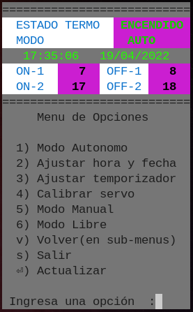

### caldera.sh
  Script para enviar peticiones web al ESP.

```
==============================
         Estado Termo         
         - ENCENDIDO -        
------------------------------
        Modo Automático       
------------------------------
     Hora  :   05:12:47
     Fecha :   16/07/2021
------------------------------
    Horario Temporizador   
    1)  ON:  5    OFF:  7 
    2)  ON: 16    OFF: 18 
==============================

  1) Funcionamiento Autonomo
  2) Ajustar hora y fecha
  3) Ajustar termporizador
  4) Calibrar Servo
  5) Modo Manual
  6) Modo Libre
  0) Salir

  Ingresa Opcion :

```

### caldera.py


